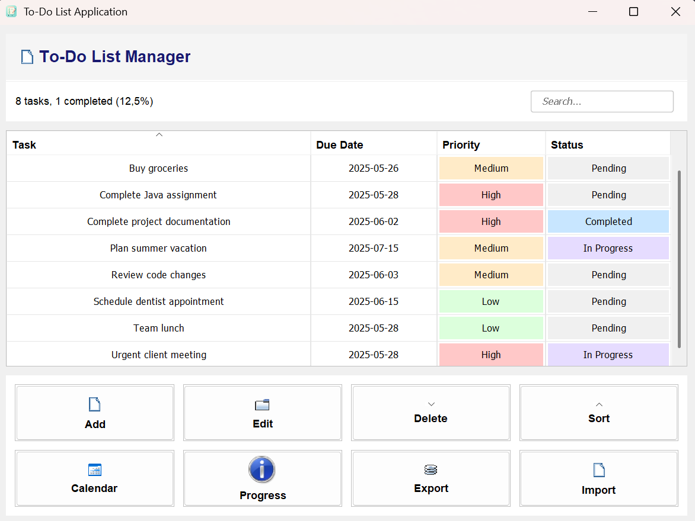
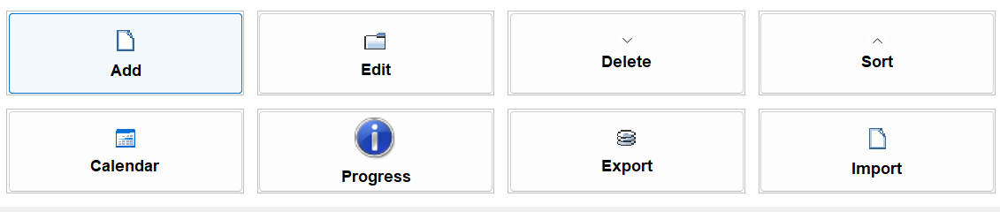
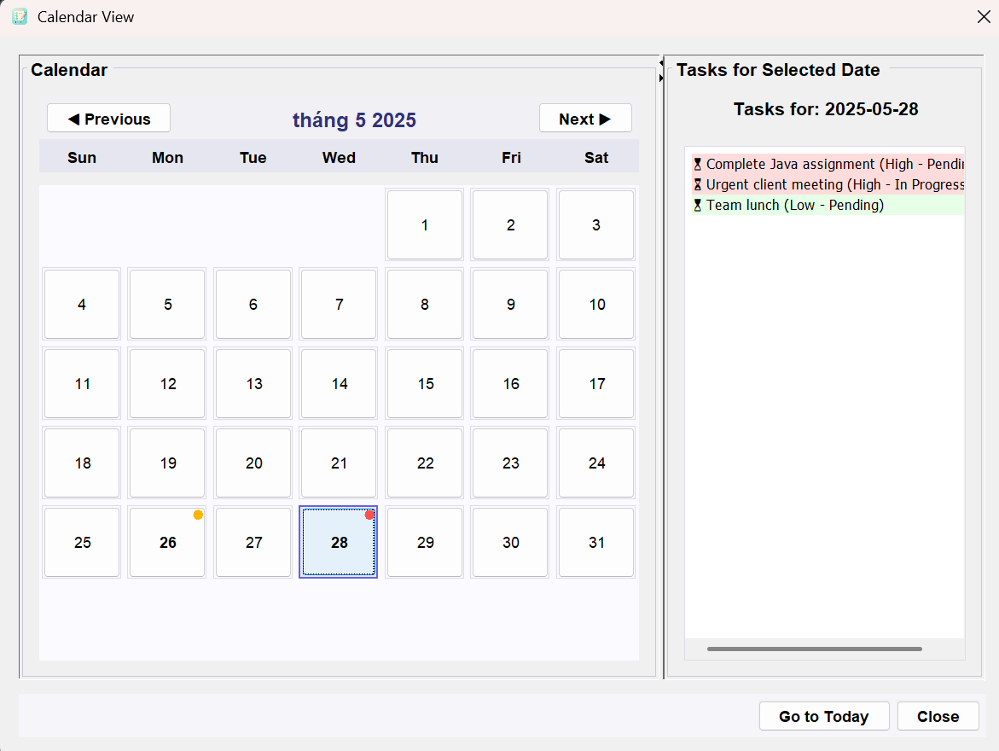

# 📝 ToDo List App (Java + Swing + Maven)

Ứng dụng quản lý công việc cá nhân với giao diện đơn giản, dễ sử dụng, được phát triển bằng Java Swing theo mô hình MVC.

## 🚀 Tính năng chính

- ✅ Thêm, sửa, xóa công việc
- ✅ Chọn ngày deadline bằng DatePicker
- ✅ Sắp xếp công việc theo ngày, độ ưu tiên
- ✅ Ghim các công việc quan trọng lên đầu danh sách
- ✅ Lưu/tải dữ liệu từ file
- ✅ Import/Export danh sách công việc
- ✅ Giao diện bảng hiển thị trực quan bằng JTable

## 🛠 Công nghệ sử dụng

- **Java 11+** - Ngôn ngữ lập trình chính
- **Swing** - Framework GUI
- **Maven** - Quản lý dependencies và build
- **MVC Pattern** - Kiến trúc phần mềm

## 📦 Cài đặt & Chạy

### Yêu cầu hệ thống

- Java 11 hoặc cao hơn
- Maven 3.6+

### Các bước chạy ứng dụng

```bash
# 1. Clone repository
git clone https://github.com/username/todo-list-maven.git
cd todo-list-maven

# 2. Biên dịch project
mvn clean compile

# 3. Chạy ứng dụng
mvn exec:java

# 4. Hoặc đóng gói thành JAR và chạy
mvn clean package
java -jar target/todo-list-app-1-jar-with-dependencies.jar
```

## 🖼 Giao diện ứng dụng

| Cửa sổ chính                                  | Dialog thêm task                              | Date Picker                                   |
| --------------------------------------------- | --------------------------------------------- | --------------------------------------------- |
|  |  |  |

## ⌨️ Phím tắt

| Phím tắt   | Chức năng              |
| ---------- | ---------------------- |
| `Ctrl + N` | Thêm task mới          |
| `Ctrl + S` | Lưu dữ liệu            |
| `Ctrl + O` | Import dữ liệu từ file |
| `Ctrl + E` | Export dữ liệu         |
| `Delete`   | Xóa task đã chọn       |
| `F2`       | Sửa task đã chọn       |

## 📁 Cấu trúc project

```
todo-list-maven/
├── src/
│   └── main/
│       ├── java/com/todoapp/
│       │   ├── ToDoListApp.java        # Main class
│       │   ├── models/
│       │   │   └── Task.java           # Data model
│       │   ├── views/
│       │   │   ├── MainWindow.java     # Cửa sổ chính
│       │   │   ├── TaskDialog.java     # Dialog thêm/sửa task
│       │   │   └── DatePickerDialog.java # Dialog chọn ngày
│       │   ├── controllers/
│       │   │   └── TaskController.java # Logic điều khiển
│       │   ├── components/
│       │   │   └── TaskTable.java      # Bảng hiển thị task
│       │   └── utils/
│       │       ├── TaskManager.java    # Quản lý danh sách task
│       │       ├── TaskStorage.java    # Lưu/tải dữ liệu
│       │       ├── UserPreferences.java # Cài đặt người dùng
│       │       └── PinnedRowSorter.java # Sắp xếp task ghim
│       └── resources/
│           ├── data/
│           │   └── data.txt           # File lưu trữ task
│           └── icons/
│               └── icon.png           # Icon ứng dụng
├── docs/
│   └── images/                        # Screenshots cho README
│       ├── main-window.png
│       ├── task-dialog.png
│       └── date-picker.png
├── target/                            # Thư mục build (tự động tạo)
├── pom.xml                           # Maven configuration
└── README.md                         # File này
```

## 🎯 Tính năng đã hoàn thành

- [x] CRUD operations cho tasks
- [x] Pin/unpin tasks quan trọng
- [x] Sắp xếp theo priority và due date
- [x] Date picker cho deadline
- [x] Lưu/tải dữ liệu tự động
- [x] Import/Export file
- [x] Keyboard shortcuts
- [x] Giao diện responsive

## 🚀 Roadmap

- [ ] Thêm categories/tags cho tasks
- [ ] Search và filter nâng cao
- [ ] Dark mode
- [ ] Notifications cho deadline
- [ ] Export to PDF/Excel
- [ ] Multi-language support

## 📄 License

Dự án này được phát hành dưới [MIT License](LICENSE).

## 👨‍💻 Tác giả

**Nguyễn Ngọc Bình**

- Email: binh.nn.65cntt@ntu.edu.vn
- GitHub: [@ngocbinh15](https://github.com/ngocbinh15)

---

⭐ Nếu project này hữu ích, hãy star repo để ủng hộ nhé!
