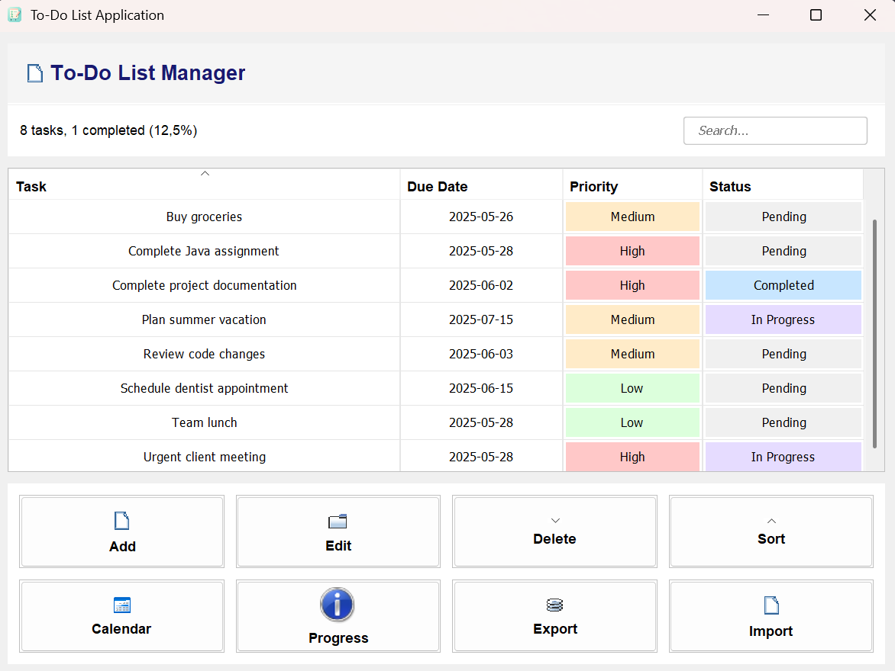
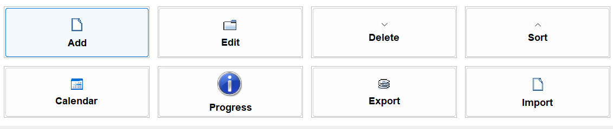
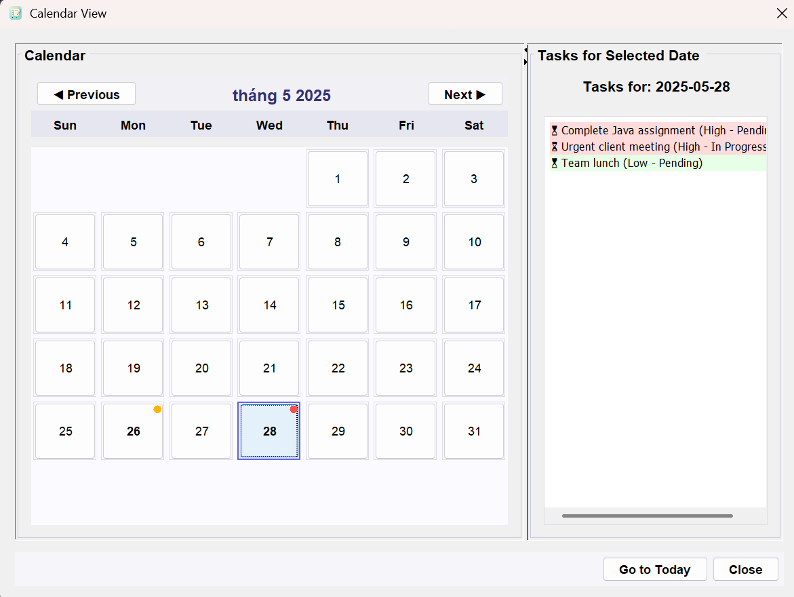

# 📝 ToDo List App (Java + Swing + Maven)

Ứng dụng quản lý công việc cá nhân với giao diện đơn giản, dễ sử dụng, được phát triển bằng Java Swing theo mô hình MVC.

## 🚀 Tính năng chính

- Thêm, sửa, xóa công việc.
- Chọn ngày deadline bằng DatePicker.
- Sắp xếp công việc theo ngày, độ ưu tiên.
- Ghim các công việc quan trọng lên đầu danh sách.
- Giao diện bảng hiển thị trực quan bằng `JTable`.

## 🛠 Công nghệ sử dụng

- Java 8+
- Swing (GUI)
- Maven (quản lý thư viện & build)
- Kiến trúc MVC

## 📦 Cách cài đặt & chạy

### 1. Clone project

```bash
git clone https://github.com/ngocbinh15/todo-list-maven.git
cd todo-list-maven
```

### 2. Build bằng Maven

#### Biên dịch dự án

```bash
mvn clean compile
```

#### Đóng gói thành file JAR

```bash
mvn clean package
```

#### Chạy file JAR

```bash
java -jar target/todo-list-app-1.0.0-jar-with-dependencies.jar
```

### 3. Chạy ứng dụng

```bash
mvn exec:java
```

> 💡 Nếu bạn dùng IDE như IntelliJ IDEA hoặc Eclipse, có thể mở project như một Maven project và chạy trực tiếp từ `ToDoListApp.java`.

## 🖼 Giao diện

| Main Window            | Task Dialog              | Date Picker              |
| ---------------------- | ------------------------ | ------------------------ |
|  |  |  |

## 📁 Cấu trúc dự án

```
src/
├── main/
│   ├── java/
│   │   └── com.todoapp/
│   │       ├── models/         # Lớp dữ liệu (Task)
│   │       ├── views/          # Giao diện (MainWindow, Dialogs)
│   │       ├── controllers/    # Điều khiển logic
│   │       ├── components/     # Thành phần giao diện tùy chỉnh (TaskTable)
│   │       └── utils/          # Tiện ích (TaskManager, PinnedRowSorter)
│   └── resources/
│       └── icons/              # Icon ứng dụng
```

## 📌 Định hướng phát triển

- [ ] Lưu danh sách ra file.
- [ ] Nhập danh sách từ file.
- [ ] Gắn tag / độ ưu tiên cho task.
- [ ] Thêm tìm kiếm / lọc nâng cao.
- [ ] Giao diện đẹp hơn (Look & Feel / FlatLaf).

## 📄 Giấy phép

Phần mềm được phát hành cho mục đích học tập / cá nhân. Nếu sử dụng lại, hãy ghi nguồn.

---

**Người phát triển:** Nguyễn Ngọc Bình  
📧 Email liên hệ: binh.nn.65cntt@ntu.edu.vn
